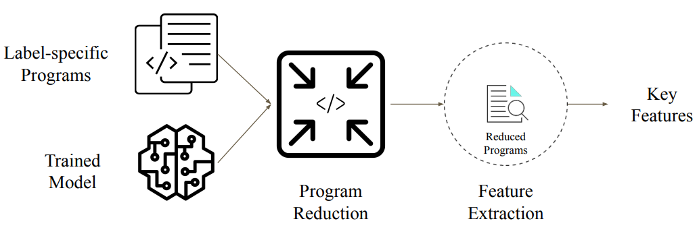

# CI-DD-Perses

This repository contains the artifacts of our paper '[Syntax-Guided Program Reduction for Understanding Neural Code Intelligence Models](https://arxiv.org/abs/2205.14374)' accepted at [MAPS'22](https://pldi22.sigplan.org/details/maps-2022-papers/8/Syntax-Guided-Program-Reduction-for-Understanding-Neural-Code-Intelligence-Models) symposium, co-located with [PLDI'22](https://pldi22.sigplan.org/) conference.

Artifact for Article (CI-DD-Perses):   
- Zenodo: https://doi.org/10.5281/zenodo.6630188

---

## Structure

```
├── code/
    ├── CI_DD              # sample code for DD with CI
    ├── CI_Perses          # sample code for Perses with CI
    ├── files              # sample input program and model

├── data/
    ├── c2v_simplified     # traces of reduced inputs with code2vec model
    ├── c2s_simplified     # traces of reduced inputs with code2seq model
    ├── summary_results    # summary results of all experiments as csv
``` 

---

## Approach

||
:-------------------------:
|Extracting key features that models have learned during training.|

---

## Citation:

[Syntax-Guided Program Reduction for Understanding Neural Code Intelligence Models](https://doi.org/10.1145/3520312.3534869)

```
@inproceedings{rabin2022features,
  author = {Rabin, Md Rafiqul Islam and Hussain, Aftab and Alipour, Mohammad Amin},
  title = {Syntax-Guided Program Reduction for Understanding Neural Code Intelligence Models},
  year = {2022},
  isbn = {9781450392730},
  publisher = {Association for Computing Machinery},
  address = {New York, NY, USA},
  url = {https://doi.org/10.1145/3520312.3534869},
  doi = {10.1145/3520312.3534869},
  booktitle = {Proceedings of the 6th ACM SIGPLAN International Symposium on Machine Programming},
  pages = {70–79},
  numpages = {10},
  location = {San Diego, CA, USA},
  series = {MAPS 2022}
}
```

---

## Other Works:

- [Understanding Neural Code Intelligence Through Program Simplification](https://doi.org/10.1145/3468264.3468539) [[arXiv](https://arxiv.org/abs/2106.03353), [GitHub](https://github.com/mdrafiqulrabin/SIVAND)]

